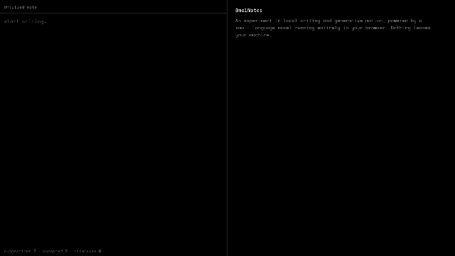

# SmolNotes

### A small notepad with a small language model inside it.

[](https://smol-notes.jasonxuyang.com)
[](#what-is-happening-locally)
[](LICENSE)

**SmolNotes is an exploration of local writing and generative motion.** Short continuations appear as you type. The model runs entirely in your tab—no account, no API key, nothing leaves the machine. On the other half of the screen, the same generation events set an ASCII field in motion. Not a scientific readout. Just a visual companion to the writing.

[Try it](https://smol-notes.jasonxuyang.com) · [How to write](#writing-with-it) · [How it works](#what-is-happening-locally)



---

## Writing with it

Start typing and pause briefly at the end of a line. A suggestion will appear as ghost text:

| Key | Action |
| --- | --- |
| **Tab** | Keep the suggestion |
| **Esc** | Let it go |
| Keep typing | Replace it with your own words |

Suggestions are deliberately short: usually a word or phrase rather than a finished thought. The model is small, local, and sometimes odd. That is part of the experiment—it can give you a nudge without trying to take over the page.

Notes stay in your browser's `localStorage`, with the 10 most recent available from the opening screen. Nothing syncs between devices.

## What is happening locally

| Write | Infer | Animate |
| --- | --- | --- |
| **Note + ghost text** | **SmolLM2 360M in a Web Worker** | **ASCII field** |
| You pause at the end of a line. Context before the caret is packed and sent across. | [WebLLM](https://github.com/mlc-ai/web-llm) runs a quantized model with WebGPU. Tokens stream back into the ghost layer. | Starts, deltas, completions, and cancels drive the right-hand field. Interpretive, not attention maps. |

On the first visit, the model downloads and caches in the browser. Later visits reuse that cache. Inference stays off the main UI thread.

```text
editor + ghost text                    Web Worker
──────────────────                    ──────────
note context ─────── postMessage ───▶ WebLLM / WebGPU
ghost suggestion ◀── token stream ─── SmolLM2 360M
ASCII field ◀──────── generation events
```

## License

[MIT](LICENSE)
